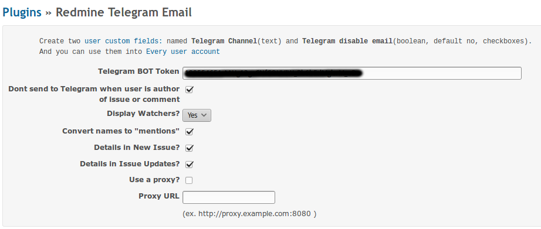
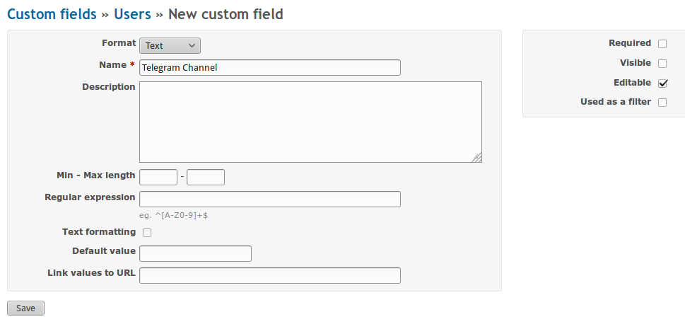
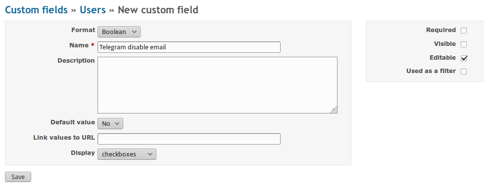

# Telegram messages plugin for Redmine

Plugin updated to redmine 4.1, need some tests, if you have troubles please create issue

This plugin send messages as email, only to the Telegram. So you can disable email and use Telegram only, or use both.  

## Installation

From your Redmine plugins directory, clone this repository as `redmine_telegram_email` (note
the underscore!):

    git clone https://github.com/aekondratiev/redmine_telegram_email redmine_telegram_email

You will also need the `httpclient` dependency, which can be installed by running

    bundle install

from the plugin directory.

Start migration command

	bundle exec rake redmine:plugins:migrate RAILS_ENV=production

Restart Redmine, and you should see the plugin show up in the Plugins page.

## Using

### Set bot token into settings

First of all go into `http://example.com/settings/plugin/redmine_telegram_email` and set some settings, important is **Telegram BOT Token**

### Creating custom fields

Create two user custom fields: `http://example.com/custom_fields/new?utf8=✓&type=UserCustomField` named **Telegram Channel** (text) and **Telegram disable email** (boolean, default no, checkboxes). **FIELDS NAMES ARE CASE SENSITIVE**

The channel can be entered per user settings http://example.com/my/account for every user who wants to get notifications, in **Telegram Channel** field, for ex: 11111111 (not phone number, but chat id). 

To disable email and use only Telegram - check **Telegram disable email** 

And you can control Telegram messages by **Email notifications** dropdown.

To get Telegram Channel id you must create bot with [BotFather](https://core.telegram.org/bots#6-botfather), then get bot token and run [bot.py](/bot.py) from this folder, send any symbols to bot and it return your Telegram Channel id.

## Update plugin

Go to plugin girectory and pull last version
	
	git pull origin master

Then start migration database to new version

	bundle exec rake redmine:plugins:migrate RAILS_ENV=production

Last step - restart Redmine.

Now you can use last version.

## Uninstall

From Redmine plugin directory run command

	bundle exec rake redmine:plugins:migrate NAME=redmine_telegram_email VERSION=0 RAILS_ENV=production

After that restart Redmine.

For more information, see http://www.redmine.org/projects/redmine/wiki/Plugins.
